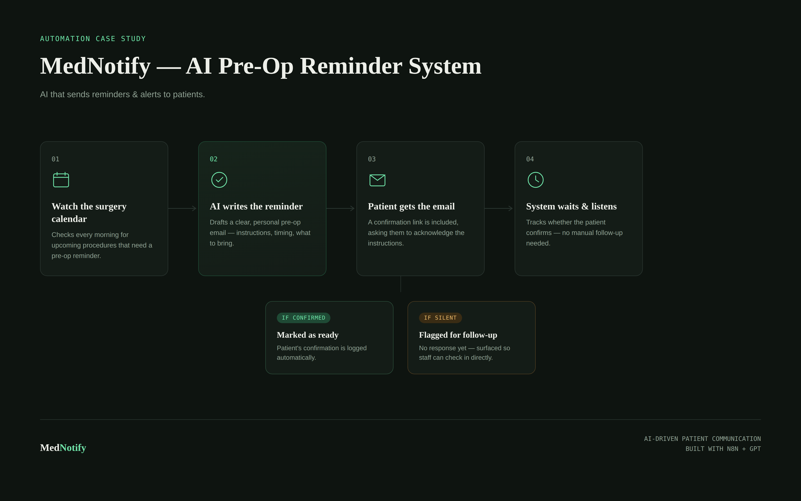

# 🩺 MedNotify — AI Pre-Op Reminder System

MedNotify is an **AI-powered patient notification automation system** built with **n8n**.

It automatically monitors upcoming surgery appointments, generates a personalized pre-surgery reminder, and sends the notification to the patient through email.

## ✨ Features

- 📅 Monitors upcoming surgery appointments
- 🤖 Generates personalized pre-surgery reminders using AI
- 📧 Automatically sends reminder emails
- 📋 Includes a pre-surgery checklist
- ✅ Provides appointment confirmation
- 🔄 Automates the complete notification workflow
- ⚡ Reduces the need for manual follow-ups

## 🔄 How It Works

The MedNotify workflow follows these steps:

1. **Appointment Detection**  
   The system checks for upcoming surgery appointments.

2. **AI Reminder Generation**  
   AI creates a clear and personalized pre-surgery reminder.

3. **Email Notification**  
   The generated reminder is automatically sent to the patient.

4. **Confirmation & Follow-up**  
   The system tracks the patient's response and handles confirmation or follow-up.

## 🛠️ Technologies Used

- **n8n**
- **Artificial Intelligence**
- **Workflow Automation**
- **Email Automation**
- **Calendar Integration**

## 📸 Workflow

## 📧 Sample Email Output

## 🎥 Working Demo

[▶️ Watch MedNotify Working Demo](MedNotifyworking.mp4)

## 🚀 Future Improvements

- WhatsApp notifications
- SMS reminders
- Voice-based notifications
- Patient dashboard
- Database integration
- Multiple appointment types
- Automated reminder scheduling

## 👩‍💻 Author

**Bhuvaneshwari Kashyap**

Built as an AI and workflow automation project using n8n.
